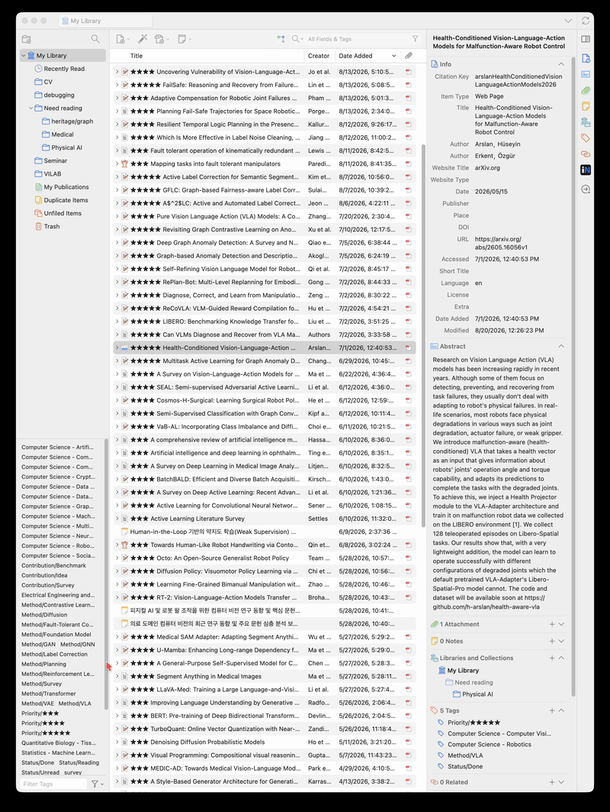

**Still maintaining parsing algorithm!**

# Zotero Reference Linker

Reference Linker marks papers in a PDF's bibliography when the same paper is already in your Zotero library. Clicking the highlight opens the saved PDF, or selects the library item when no PDF is attached.

The highlights are part of the reader UI. They do not modify the PDF or create Zotero annotations.



## Install

1. Download the latest XPI from [GitHub Releases](https://github.com/ottersem/zotero-reference-linker/releases/latest).
2. In Zotero, open **Tools → Plugins**.
3. From the gear menu, choose **Install Plugin From File…**.
4. Select the XPI and restart Zotero.

Zotero 9 and 10 are supported.

## npm package

The project is also available on npm:

```bash
npm install zotero-reference-linker
```

The npm package contains the unpacked extension in `node_modules/zotero-reference-linker/build/`. It is intended for development, automated builds, and downstream packaging. For normal Zotero installation, use the XPI from [GitHub Releases](https://github.com/ottersem/zotero-reference-linker/releases/latest) instead.

Package page: [npmjs.com/package/zotero-reference-linker](https://www.npmjs.com/package/zotero-reference-linker)

## Use

Open a PDF, go to its references pages, and click **Ref ↗** in the reader toolbar. References found in your library are highlighted in yellow.

- `↗ PDF` opens the saved PDF attachment.
- `↗ Item` selects the parent item in Zotero.
- Clicking the highlighted text does the same thing as clicking its badge.

Zotero only keeps nearby PDF pages rendered. If nothing appears, scroll through the references pages once and run the scan again.

## Matching

The plugin looks for matches in this order:

1. DOI
2. arXiv ID
3. Normalized title
4. Fuzzy title match, using author and year as supporting metadata

Both numbered references (`[12]`, `12.`) and author–year bibliographies are supported. Title matching ignores capitalization, punctuation, whitespace, and line-break hyphenation.

## Build

Node.js 20 or newer is required.

```bash
npm install
npm run verify
```

`npm run verify` runs the type checker and tests, then creates:

- `build/` — unpacked extension
- `zotero-reference-linker-0.9.0.xpi` — installable package

Individual commands are also available:

```bash
npm run typecheck
npm test
npm run build
npm run clean
```

Before publishing a new npm version, inspect the package contents:

```bash
npm pack --dry-run
npm publish
```

The `prepack` script runs the full verification step automatically. npm versions cannot be overwritten, so update both `package.json` and `manifest.json` before publishing a new release.

## Source layout

```text
bootstrap.js                   Zotero extension lifecycle
manifest.json                  Extension metadata
src/index.ts                   Entry point
src/core/CitationParser.ts     Citation metadata parser
src/core/LibraryMatcher.ts     Library index and matching
src/core/PdfSectionExtractor.ts
src/reader/ReaderIntegration.ts
src/reader/ReferenceOverlay.ts
test/                          Vitest tests
```

The section extractor first uses Zotero's PDF outline. When no references entry is available there, it searches the document for a References, Bibliography, or Works Cited heading. Appendix and supplementary-material headings are used as section boundaries.

## Development install

After building, create this proxy file in the active Zotero profile:

```text
extensions/zotero-reference-linker@ottersem.github.io
```

Its contents should be the absolute path to the project's `build` directory. Restart Zotero after changing the build.

## Limitations

- Image-only PDFs need OCR.
- Text extraction order depends on the PDF's text layer. Some complex layouts may not scan correctly.
- Reference pages must be rendered in the reader before their highlights can be drawn.
- Zotero Reader's internal DOM can change between releases.

## Reporting a problem

Include the Zotero and plugin versions, the citation style, and one reference that failed to match. A link to the paper is useful when the PDF is public.
